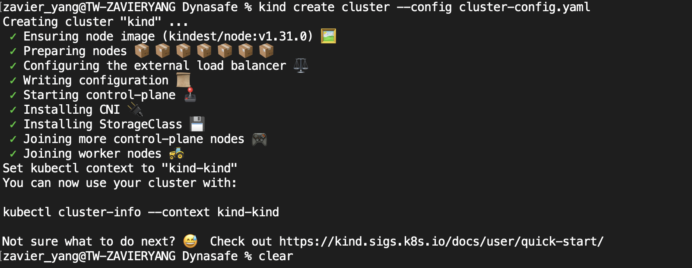
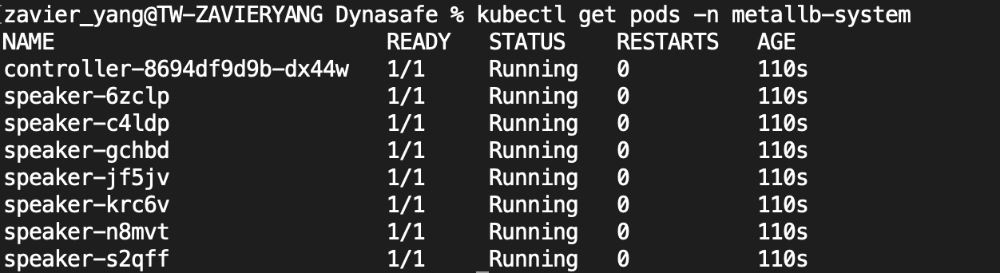
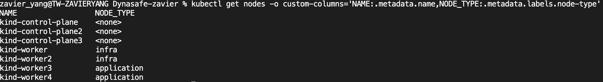
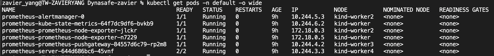
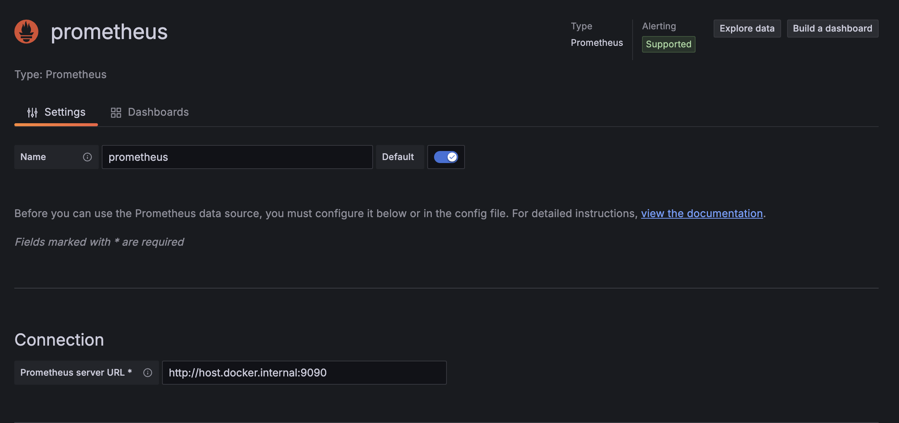
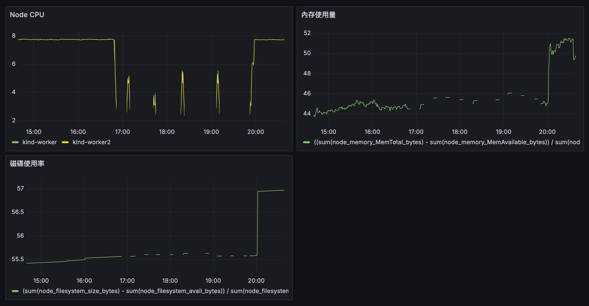
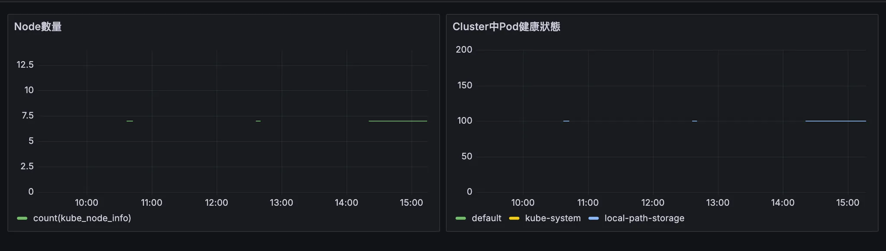
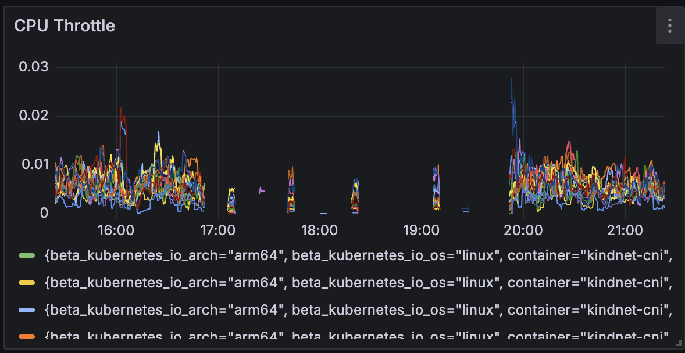
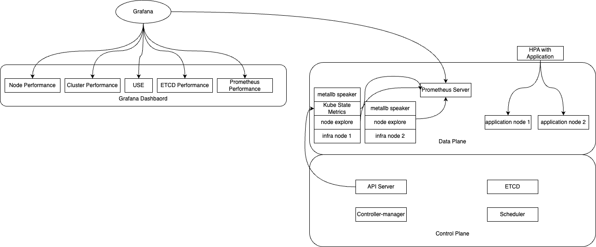

### 第一題以及第二題
1. kubectl 和 Docker 原本就已经有了，因此需要安装 KIND。
   ```bash
    go install sigs.k8s.io/kind@v0.24.0
    chmod +x ./kind
    sudo mv ./kind /usr/local/bin/kind
2. 建立yaml: [Config](./kubernetes/cluster-config.yaml)。並且用Label標示出worker的功用，及infra以及application，以方便用nodeSelector決定pod要部署在哪個node。
3. 啟動cluster。
  
   ```bash
    kind create cluster --config ./kubernetes/cluster-config.yaml

### 第三題 (沒有完成)
1. 因為不熟悉metalLB，故安裝時使用[官方文檔](https://metallb.universe.tf/installation/)的方式進行操作。
2. 執行以下進行安裝
   ```bash
    kubectl apply -f https://raw.githubusercontent.com/metallb/metallb/v0.14.8/config/manifests/metallb-native.yaml
3. 執行以下抓取internal ip 來設置L2設定所需要的ip pool range
   ```bash
    kubectl get nodes -o wide
4. 建立[IPAddressPool](./metallb/IPAddressPool.yaml)後執行apply進行套用
   ```bash
    kubectl apply -f ./metallb/IPAddressPool.yaml
5. 建立[L2Advertisement](./metallb/L2Advertisement.yaml)後執行apply進行套用
   ```bash
    kubectl apply -f ./metallb/L2Advertisement.yaml
6. 雖然都有部署成功，有嘗試用nginx進行嘗試，或是用prometheus service改為LoadBalancer進行嘗試，但都無法成功用external ip進行連線
  
7. 關於只部署在infra node上，因為不熟悉從manifast部署怎麼會入設定檔，故改用準備[patch file](./metallb/metallb-patch.yaml)後執行apply進行套用
   ```bash
    kubectl patch daemonset speaker -n metallb-system --patch-file ./metallb/metallb-patch.yaml

### 第四題
1. 因為沒有從0建置Prometheus的經驗，所以安裝Prometheus是用helm已經包裝好的版本進行安裝。安裝前因為需要把特定pod建立在某個node，所以要寫[values.yaml](./prometheus/values/prometheus-values.yaml)進行設定
2. 執行以下進行helm安裝並套用values的設定
   ```bash
    helm install prometheus prometheus-community/prometheus -f prometheus/values/prometheus-values.yaml
3. 安裝完後可以執行下可以確定只能部署在infra上面的pod是否只有在infra node上
  
  
   ```bash
    kubectl get nodes -o custom-columns='NAME:.metadata.name,NODE_TYPE:.metadata.labels.node-type'
    kubectl get pods -n default -o wide

### 第五題
1. 安裝grafana
   ```bash
    docker pull grafana/grafana
2. 運行grafana並指定port以讓我們訪問Grafana UI
   ```bash
    docker run -d --name=grafana -p 3000:3000 grafana/grafana
3. 登入後，要將Prometheus加入到data source中。但因為metalLB沒有安裝成功，Prometheus並沒有辦法透過metalLB存取，故要先把port forward出來讓Grafana能夠存取Prometheus。
   ```bash
    kubectl port-forward svc/prometheus-server 9090:80
4. 將Prometheus加入到data source中
  
#### 五之一
1. 加入以下query。此用意是在監測Node CPU 使用率
   ```promQL
    sum(rate(node_cpu_seconds_total[5m])) by (node)
2. 加入以下query。此用意是在監測內存使用率
   ```promQL
    ((sum(node_memory_MemTotal_bytes) - sum(node_memory_MemAvailable_bytes)) / sum(node_memory_MemTotal_bytes)) * 100
3. 加入以下query。此用意是在監測磁碟使用率
   ```promQL
    (sum(node_filesystem_size_bytes) - sum(node_filesystem_avail_bytes)) / sum(node_filesystem_size_bytes) * 100
4. Dashboard完整圖
  

#### 五之二
1. 加入以下query。此用意是在監測每個namespace的pod是否都在完全運行中
   ```promQL
    (sum(kube_pod_status_ready) by (namespace) / count(kube_pod_info) by (namespace)) * 100
2. 加入以下query。此用意是在監測當前node數量為多少(因為通常會搭配auto scaling來擴展node數量，故加上這個)
   ```promQL
    count(kube_node_info)
3. Dashboard完整圖
  

#### 五之五
1. 加入以下query。此用意是在監測query的延遲
   ```promQL
    sum(increase(prometheus_engine_query_duration_seconds[5m]))
2. 加入以下query。此用意是在監測啟用中的Series數量，因為這個會影響內存。直接看內存使用率是最好的
   ```promQL
    prometheus_tsdb_head_series
3. 加入以下query。此用意是在監測HTTP Status Code數量，看是否有異常
    sum(prometheus_http_requests_total) by (code)


#### 五之六
在以上就已經說明

#### 五之七
1. 可以增加以下panel。主要是顯示container需要多少額外的 CPU 核心才能在沒有CPU限制的情況下運作。
   ```promQL
    rate(container_cpu_cfs_throttled_seconds_total[5m])
2. Dashboard完整圖
  


### 第七題
  